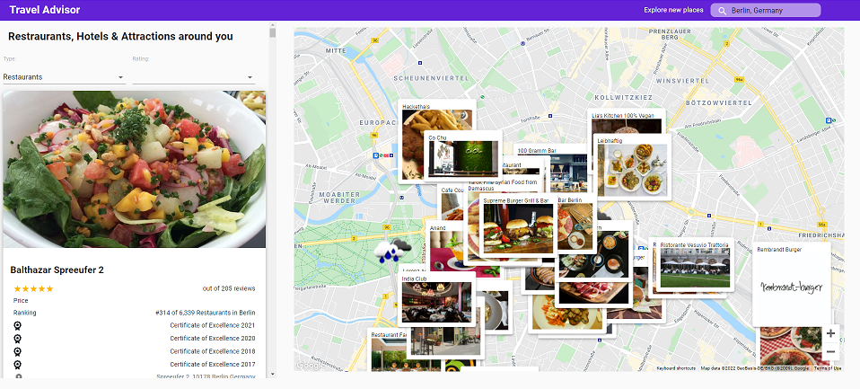

# Travel Advisor



---

### Table of Contents

- [Description](#description)
- [How To Use](#how-to-use)
- [API References](#api-references)
- [License](#license)
- [Author Info](#author-info)

---

## Description

This is a travel advisor web app that list popular nearby places and weather data based on user's location.

#### Technologies

- React JS

[Back To The Top](#travel-advisor)

---

## How To Use

The website is published at [Travel Advisor]

Clone the project 

```bash
  git clone https://github.com/pras306/travel-advisor.git
```

Go to the project directory

```bash
  cd travel-advisor
```

Install dependencies

```bash
  npm install
```

Start the server

```bash
  npm run start
```

---

## API References

- [Travel Advisor Rapid API](https://rapidapi.com/apidojo/api/travel-advisor/)
- [Open Weather Map Rapid API](https://rapidapi.com/community/api/open-weather-map/)
- [Google Maps API](https://developers.google.com/maps)
- Custom Proxy Server for hiding API key - [https://backend-portfolio-proxy.herokuapp.com/api/v1](https://backend-portfolio-proxy.herokuapp.com/api/v1)

#### GET place details

```http
  GET /traveladvisor/place?list_option=${list_option}&bl_latitude=${bl_latitude}&tr_latitude=${tr_latitude}&bl_longitude=${bl_longitude}&tr_longitude=${tr_longitude}
```

| Parameter        | Type     | Description                                                                         |
| :----------      | :------- | :---------------------------------------------------------------------------------- |
| `list_option`    | `string` | **Required**. can be one of three place type - Restaurants, Hotels and Attractions  |
| `bl_latitude`    | `number` | **Required**. latitude value of bottom left boundary in google maps                 |
| `tr_latitude`    | `number` | **Required**. latitude value of top right boundary in google maps                   |
| `bl_longitude`   | `number` | **Required**. longitude value of bottom left boundary in google maps                |
| `tr_longitude`   | `number` | **Required**. longitude value of top right boundary in google maps                  |


#### GET weather

```http
  GET /openweather/find?lat=${lat}&lng=${lng}
```

| Parameter   | Type     | Description                                       |
| :---------- | :------- | :------------------------------------------------ |
| `lat`       | `number` | **Required**. the latitude value of the place     |
| `lng`       | `number` | **Required**. the longitude value of the place    |


[Back To The Top](#travel-advisor)

---

## License

MIT License

Copyright (c) [2021] [Prasanna Sriram]

Permission is hereby granted, free of charge, to any person obtaining a copy
of this software and associated documentation files (the "Software"), to deal
in the Software without restriction, including without limitation the rights
to use, copy, modify, merge, publish, distribute, sublicense, and/or sell
copies of the Software, and to permit persons to whom the Software is
furnished to do so, subject to the following conditions:

The above copyright notice and this permission notice shall be included in all
copies or substantial portions of the Software.

THE SOFTWARE IS PROVIDED "AS IS", WITHOUT WARRANTY OF ANY KIND, EXPRESS OR
IMPLIED, INCLUDING BUT NOT LIMITED TO THE WARRANTIES OF MERCHANTABILITY,
FITNESS FOR A PARTICULAR PURPOSE AND NONINFRINGEMENT. IN NO EVENT SHALL THE
AUTHORS OR COPYRIGHT HOLDERS BE LIABLE FOR ANY CLAIM, DAMAGES OR OTHER
LIABILITY, WHETHER IN AN ACTION OF CONTRACT, TORT OR OTHERWISE, ARISING FROM,
OUT OF OR IN CONNECTION WITH THE SOFTWARE OR THE USE OR OTHER DEALINGS IN THE
SOFTWARE.

[Back To The Top](#travel-advisor)

---

## Author Info

- Github - [pras306](https://github.com/pras306)
- LinkedIn - [Prasanna Sriram](https://www.linkedin.com/in/prasanna-sriram/)
- Portfolio - [Personal Portfolio](https://prasanna-sriram.netlify.app/)

[Back To The Top](#travel-advisor)